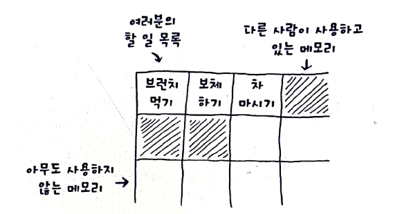
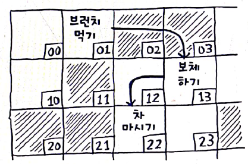
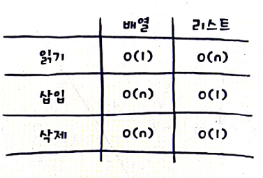
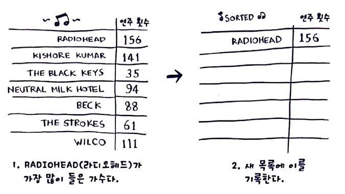

# 1 메모리가 동작하는 방법
> 여러개의 원소를 저장하려면 array와 linked list 중에 하나를 선택해야 함. 

# 2. Array vs Linked List
## Array

> - 내가 할일이 4개면 아래쪽에 다시 할당해야 함.  
> - 미리 크게 할당할수 있지만 안 쓰면 메모리 낭비  
> - 원하는 임의의 원소값을 바로 읽을수 있음. 

## Linked List

> - 각 원소는 다음 원소의 위치를 저장하고 있음.  
> - 원소를 메모리 어디다가 놓아도 됨. 
> - 원소를 옮길 일이 없음. 
> - 마지막 원소를 읽고 싶으면 바로 읽을수 없음.

## 비교 

# 3. 선택정렬
