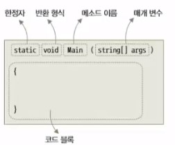
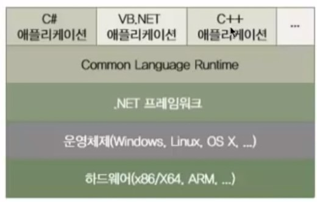

# 프로그램 생성 및 실행
1. 프로젝트 새로 만들기
2. console app
3. 빌드하기 (Shift + F6)
4. 빌드 결과 확인
5. 실행

# 프로그램 뜯어보기
## using System
> - using : C# 키워드
> - System : 기본 클래스의 네임스페이스
> - 세미콜론(;) : 문장의 끝 
> - _ : 줄 바꿈

## using static System.Console
> - using static : 데이터 형식의 정적 멤버 사용
> - Console 클래스의 대표적인 정적 멤버 : Write(), WriteLine(), Read(), ReadLine()

## namespace BrainCSharp{}
> - 네임스페이스 
>   - 성격, 하는 일이 비슷한 형식을 하나의 이름으로 그룹화
>   - .NET 프레임워크 라이브러리 (System.IO, System.Printing)
> - 네임스페이스 만들기
>   - Namespace 키워드
>   - 형식
> ```cs
> namespace 네임스페이스 이름
> {
>    // 클래스
>    // 구조체
>    // 인터페이스 등..
> }

## class HelloWorld{}
> - 클래스 
>   - C# 프로그램을 구성하는 기본 단위
>   - 데이터와 데이터 처리 기능(메서드)
>   - class class_name {}

## C# 주석 (소스 코드 안에 기록하는 메모)
> - 소스 코드 안에 기록하는 메모
> - 컴파일러는 주석을 처리하지 않음
> - // : 한줄 주석 (주로 권장)
> - /* */ : 여러 줄 주석

## static void Main(string[] args){}
> - 메소드
>   - c 프로그래밍 언어 : 함수
>   - 객체 지향 프로그래밍 : 메서드
>   - 입력(객체) -> 계산 -> 출력 (객체)
> - 진입점 (Entry Point)
>   - 특별한 메소드, Main
>   - 프로그램 시작 시 실행
>   - Main 메소드 종료 시 프로그램 종료
>   - 프로그램 실행 시 매개 변수 입력



## if(args.Length==0){}
> - 매개변수 입력이 필요한 프로그램
> - if 문
>   - 조건을 평가해 프로그램의 흐름 제어
>   - 목록의 길이 검사 (args.Length == 0)
> - Return
>   - 호출자에게 메서드 실행 결과 반환
>   - Main 메서드 종료 

# CLR에 대하여
## Common Language Runtime
> - C#으로 만든 프로그램의 실행 환경
> - 중간 언어를 통한 다중 언어 지원
> - 플랫폼 최적화된 코드 생성 



## C# 코드의 여정
> - C# 컴파일러
> - IL(Intermediate Language) 파일 (컴파일 하면 나오는 코드)
> - JIT(Just In Time) 컴파일(CLR의 역할)) : CLR의 IL 코드 -> 네이티브 코드 컴파일 -> 실행