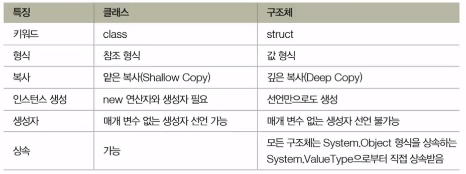

# 7.1 객체 지향 프로그래밍과 클래스 
- 코드 내의 모든 것을 객체로 표현하려는 프로그래밍 패러다임
  - 객체(object) : 세상의 모든 것을 지칭
- 객체의 표현
  - 속성: 데이터
  - 기능: 메서드
- 클래스 : 객체를 만들기 위한 청사진
- int a = 30;
  - int : 클래스, 청사진
  - a: 객체, int의 실체(instance)

# 7.2 클래스의 선언과 객체의 생성
- 클래스의 선언 형식
```c#
class 이름
{
    // 데이터와 메서드
}
```
- 클래스의 선언과 사용 예

`sample code : BasicClass` 

# 7.3 객체의 삶과 죽음에 대하여: 생성자와 종료자
- 객체의 삶과 죽음을 관장하는 두 가지 메서드
- 객체를 만드는 생성자
- 객체를 파괴하는 종료자
# 7.3.1 생성자
- 클래스와 같은 이름, 반환 형식 없음
- 선언 형식
- 기본 생성자
- 사용자 지정 생성자 (매개변수 넣어서)
# 7.3.2 종료자
- 클래스 이름 앞에 ~를 붙인 꼴
- 매개변수도 없고, 한정자도 사용하지 않음
- 오버로딩 불가능, 직접 호출 할수 없음
- 종료자는 사용하지 말자
  - CLR의 가비지 컬렉터의 동작 시점 예측 불가능
  - 명시적 종료자 구현은 성능 저하 초래 가능성 높음
  - CLR의 가비지 컬렉터는 객체 소멸 처리 전문가다. gc에 맡기는게 낳음   

` sample source : Constructor`

# 7.4 정적 필드와 메소드
- static 은 메소드나 필드가 클래스 자체에 소속되도록 지정하는 한정자
  - 프로그램 전체에 공유하는 변수에 사용  

`sample source : StaticField`
- 정적 메소드는 클래스 자체에 소속됨
  - 클래스 인스턴스 생성 없이도 호출 가능
- 인스턴스 생성이 필요한 메서드
  -  인스턴스 메서드, 객체 내부의 데이터 이용

# 7.5 객체 복사하기: 얕은 복사와 깊은 복사 
- 얕은 복사
  - 객체를 복사할 때 참조만 살짝 복사 (같은 데이터 가르킴)
- 깊은 복사
  - 별도의 힙 공간에 객체 자체 복사

`sample source: DeepCopy`

# 7.6 this
- 객체가 자신을 지칭할 때 사용하는 키워드 this
  - 객체 내부에서 자신의 필드나 메소드에 접근할 때 사용

`sample source: This`
- this() 생성자

`sample source: ThisConstructor`

# 7.7 접근 한정자로 공개 수준 결정하기 
- 은닉성(캡슐화)의 구현
  - 감추고 싶은 것은 감추고, 보여주고 싶은 것만 보여준다
- 접근 한정자의 종류
  - public
  - protected
  - private (default)
  - internal
  - protected internal
  - private protected

`sample source: AccessModifier`  

# 7.8 상속으로 코드 재활용하기(1)
- 물려받는 클래스가 물려줄 클래스 지정
- 상속의 형식
- 파생 클래스의 수명 주기
  - 기반 생성자 -> 파생 생성자 -> 파생 종료자 -> 기반 종료자
- 기반 클래스의 멤버 호출 -> base
  - 파생 클래스의 생성자에서 기반 클래스 생성자에 매개변수 전달

`sample source: Inheritance`  

# 7.9 기반 클래스와 파생 클래스 사이의 형식 변환
- 기반 클래스와 파생 클래스 사이에 족보를 오르내리는 형식 변환이 가능
- 파생 클래스의 인스턴스를 기반 클래스의 인스턴스로 사용 가능

# 7.9 is 와 as
- is : 객체가 해당 형식에 해당하는지를 검사하여 그 결과를 bool 값으로 반환 
- as : 형식 변환 연산자와 같은 역할을 합니다. 다만 형변환 연산자가 변환에 실패하는 경우 예외를 던지는 반면에 as 연산자는 객체 참조를 null로 만든다는 것이 다름. (참조형식에서만 사용함)

`sample source: TypeCasting`

# 7.10 오버라이딩과 다형성
- 객체가 여러 형태를 가질 수 있음을 의미
  - 하위 형식 다형성(subtype polymorphism)
```c#
class Ironman : ArmorSuite
{
    public override void Initialize()
    {
        base.Initialize();
        Console.WriteLine("Repulsor Rays Armed");
    }
}
class WarMachine : ArmorSuite
{
    public override void Initialize()
    {
        base.Initialize();
        Console.WriteLine("Double-Barrel Cannons Armed");
        Console.WriteLine("Micro-Rocket Launcher Armed");
    }
}
```
- 오버라이딩
  - 조건: 대상 메서드를 virtual 키워드로 선언
  - private 로 선언한 메서드는 오버라이딩 불가
  - 재 정의를 위해 override 키워드 사용

`Sample Source: Overriding`

# 7.11 메서드 숨기기
- 기반 클래스의 메서드를 감추고 파생 클래스 구현만 표시
- 파생 클래스 버전의 메서드를 new 한정자로 수식
```c#
class Base 
{
    public void MyMethod()
    {
        Console.WriteLine("Base.MyMethod()");
    }
}
class Derived : Base
{
    public new void MyMethod()
    {
        Console.WriteLine("Derived.MyMethod()");
    }
}
```
- 오버라이드와 다름 -> 완전한 다형성 표현의 한계

`sample source: MethodHiding`

# 7.12 오버라이딩 봉인하기 
- 메소드의 오버라이딩 봉인
  - 대상 - virtual 가상 메소드를 오버라이딩한 메서드
  - 오작동 위험이 있거나 잘못 오버라이딩함으로써 문제가 예상되는 경우
```c#
class Base
{
    public virtual void SealMe()
    {
        //...
    }
}

class Derived : Base
{
    public sealed void SealMe()
    {
        //...
    }
}
```
`Sample source: SealedMethod`

# 7.13 중첩 클래스
- 클래스 안에 선언되어 있는 클래스 
  - 소속되어 있는 클래스의 멤버에 자유롭게 접근 (private 멤버 포함)
- 선언 형식

```c#
class OuterClass
{
    class NestedClass
    {
        //...
    }
}
```
- 사용 이유
  - 클래스 외부에 공개하고 싶지 않은 형식을 만들고자 할때
  - 현재 클래스의 일부처럼 표현 가능한 클래스를 만들고자 할 때

`Sample source: NestedClass`

# 7.14 분할 클래스
- 여러 번에 나눠서 구현하는 클래스
  - 클래스의 구현이 길어질 경우 여러 파일에 나눠서 구현
    - 소스 코드 관리의 편의를 제공
  - partial 키워드 사용
- 사용 형식 
```c#
partial class MyClass
{
    public void Method1(){}
    public void Method2(){}
}
partial class MyClass
{
    public void Method3(){}
    public void Method4(){}
}
```

# 7.15 확장 메소드
- 기존 클래스의 기능을 확장하는 기법
- 선언 방법

`Sample source: ExtensionMethod`

# 7.16 구조체
- 클래스 vs 구조체
  


`Sample source: Structure`

# 7.17 튜플
- 여러 필드를 담을 수 있는 구조체
  - 형식의 이름을 갖지 않음
  - 임시적으로 사용할 복합 데이터 형식 선언에 적합
- 튜플 선언
  - 명명되지 않은 선언
  - 명명된 선언
- 튜플 분해