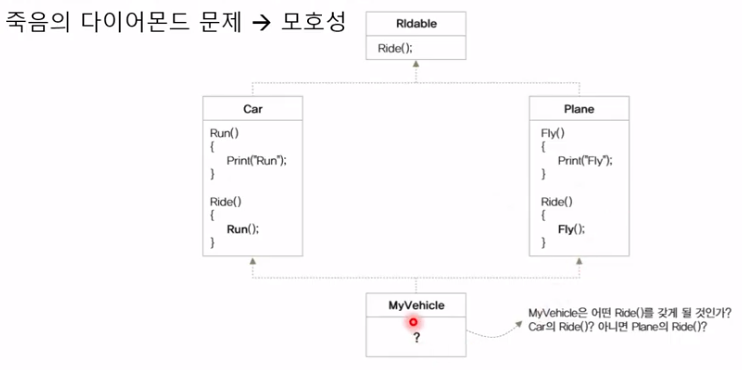

# Chapter 08 Interface & Abstract

## 8.1 Interface 선언
> - 가능한 멤버: method, event, property, indexer?
> - implementation X
> - instance X (참조는 가능)
> - public
> - 인터페이스를 상속받은 클래스의 instance 생성 가능
>``` csharp
>interface ILogger
>{
>   void WriteLog(string log);
>}
>```
>``` csharp
>class ConsoleLogger : ILogger
>{
>   public void WriteLog(string message)
>   {
>       Console.WriteLine(message);
>   }
>}
>
>/* No instance (참조는 가능), 인터페이스를 상속받은 클래스의 instance 생성 가능 */
>ILogger logger = new ConsoleLogger();
>logger.WriteLog("Hello World");
>```

## 8.2 Interface는 약속이다
> - class가 따라야 하는 약속
> - child class가 어떤 method를 implement할지 정의

## 8.3 Interface를 상속하는 interface
> - 새로운 기능을 추가한 interface를 만들고 싶을 때
> - 필요한 interface가 source code가 없고 assembly로만 제공되는 경우
> - 필요한 interface를 이미 상속한 class가 있는 경우

## 8.4 interface의 다중 상속(Multiple Inheritance)
> - 문제점
>   - 
>   - 업캐스팅의 문제
>``` csharp
>Plane plane = new MyVehicle();
>Car car = new MyVehicle();
>```
> - 단순한 외형만 상속함으로 내부 구현은 상속자에게 맡김

## 8.5 Abstract class
> - instance X
> - implementation O
> - access modifier O (public, protected, internal, protected internal)
> - 다른 Abstract class 상속 가능
>   - 부모 abstract method를 구현할 의무 없음
> - Derived class에서 abstract method 구현 필수
