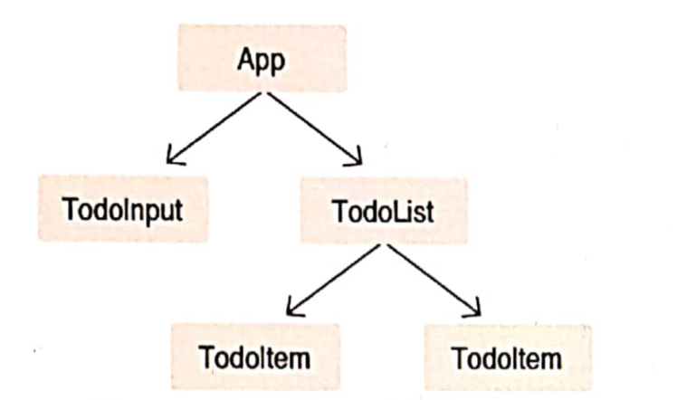

## Redux 란
```
리엑트에서 상태를 더 효율적으로 관리하는 데 사용하는 상태 관리 라이브러리입니다.
! 독립된 라이브러리
```



* App state update시 리엑트 특성상 하위 컴포넌트도 모두 렌더링한다.(shouldComponentUpdate 사용해서 방지할수 있다)
하지만 만약 컴포넘트 개수가 많아진다면?

리덕스 : 상태 관리의 로직을 컴포넌트 밖에서 처리하는것.


이벤트 발상 -> 액션 -> 디스패트 -> 리듀서 -> 스토어 -> 구독 컴포넌트

* 액션
스토어에서 상태 변화를 일으킬 때 참조하는 객체. (type 값을 반드시 가지고 있어야함.)
해당 액션의 작업의 정의.

```js
const INCREMENT = 'INCREMENT'
const DECREMENT = 'DECREMENT'

const increment = (diff) => ({
    type: INCREMENT
    diff: diff
})

const decrement = (diff) => ({
    type: DECREMENT
    diff: diff
})

```

* 리듀서
상태에 변화를 일으키는 함수 (두개의 파라미터를 받는다.1: 현재 상태, 2: 액션 객체)
!초기값 설정

```js
const initialState = {
    number: 0
}

function counter(state = initialState, action) { //if state is undefined, set initialState
    switch(action.type) {
        case INCREMENT:
            return { number: state.number + action.diff}
        case DECREMENT:
            return { number: state.number - action.diff}
        default:
            return state
    }
}

```

* 

```js
const initialState = {
    number: 0,
    foo: 'bar',
    baz: 'qux'
}

function counter(state = initialState, action) { 
    switch(action.type) {
        case INCREMENT:
            return { 
                ...state,
                number: state.number + action.diff
            }
        case DECREMENT:
            return { 
                ...state,
                number: state.number - action.diff
            }
        default:
            return state
    }
}

```


* 리덕스의 세가지 규척
 1. 스토어는 언제나 단 한개
 2. state 는 읽기 전용
 3. 변화는 순수 함수로 구성 (리듀서 함수 내부에서 외부 네트워크와 데이터 베이스에 직접 접금하면 안됨)

 * 정리
 리덕스는 스토어에 상태 정보를 가진 객체를 넣어두고, 액션이 디스패치 되었을 때 리듀서 함수를 이용하여 상태를 
 변화시키는 것이 주요 역할입니다.그리고 상태가 변화될 때마다 스토어에 구독된 함수를 실행시킵니다.
