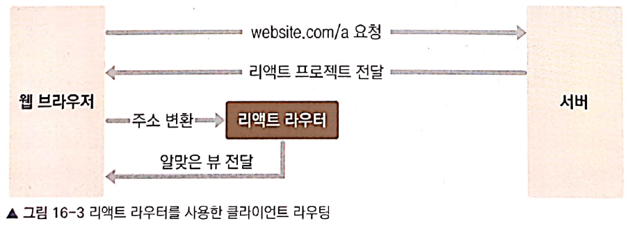

# 16.1 SPA란?
> - SPA(Single Page Application)
> - 전통적인 페이지는 여러 페이지로 구성되어서 요청이 여러번 일어남. 요청 할때마다 페이지를 새로 고침하며 페이지를 로딩할때마다 서버에서 리소스를 전달받아 해석한후 렌더링 
> - 전통적인 방법은 상호작용이 많은 모던 웹 어플리케이션에 적합하지 않음. 서버 자원 렌더링을 사용하여 불필요한 트래픽 낭비
> - 리액트 같은 library를 사용하여 뷰 렌더링을 웹 브라우저가 담당
> - 페이지에 들어온 후 이동시 새로운 페이지를 요청하는것이 아니라 필요한 데이터만 받아와 다른 종류의 뷰를 만들어 냄.
> - 주소에 따라 다른 뷰를 보여 주는 것을 라우팅이라고 함. 
> 
> - 단점
>   - 앱 규모가 커지면 javascript 파일 크기도 너무 커짐 
>   - code splitting 으로 라우트 별로 파일을 나누어 트래픽과 로딩 속도를 개선할수 있음.

# 16.2 프로젝트 구성

# 16.4 라우트 이동
## 16.4.1 Link 컴포넌트
> - 어플리케이션 안에서 다른 라우트로 이동할때 a 태그 형식으로 하면 안됨. 페이지를 새로 고침하면서 로딩하기 때문
> - Link 컴포넌트를 사용하면 페이지를 새로고침하지 않고 주소 창 상태를 변경하고 원하는 라우트로 화면 전환 함

# 16.6 라우트로 사용된 컴포넌트가 전달받는 props
## 16.6.1 location
> - 현재 주소 상태를 알려줌. 
> - 어떤 route component에서 조회하든 같음.
> - 주로 search 값에서 URL Query를 읽는데 사용하거나 주소가 바뀐것을 감지하는데 사용

## 16.6.2 match
> - <Route> 컴포넌트에서 설정한 path와 관련된 데이터를 조회할때 사용
> - 현재 URL이 같을지라도 다른 라우트에서 사용된 match는 다른 정보를 알려줌.
> - 주로 params를 조회하거나 서브 라우트를 만들때 현재 path를 참조 하는데 사용

## 16.6.3 history
> - 현재 라우터를 조작할때 사용 (페이지 이동)
> - push, replace, action, pop, block, go, goBack, goForward

# 16.7 withRouter로 기타 컴포넌트에서 라우터 접근
> - 라우트 내부 또는 외부 컴포넌트에서는 history, location, match등의 값을 사용할수 없음.
> - 이 경우에 withRouter를 사용하여 props에 접근할수 있음. 