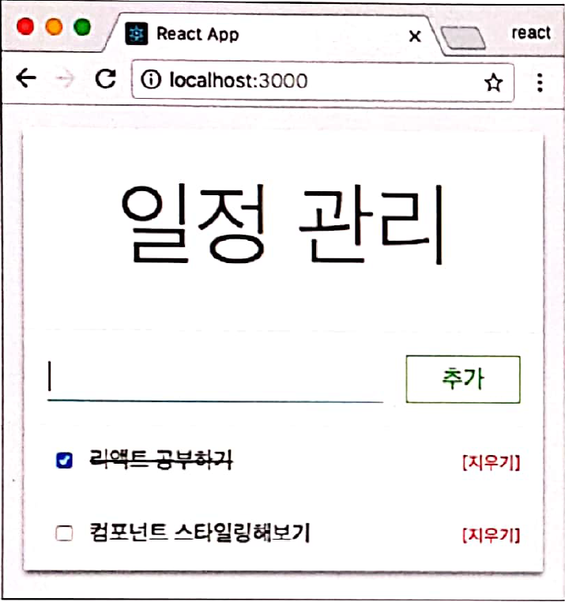
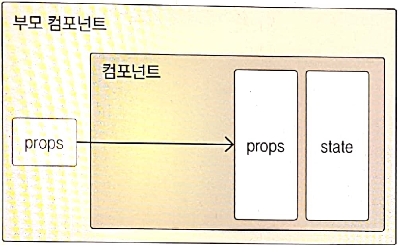

## Component
> 1. 컴포넌트 기능은 단순한 템플릿 이상
> 2. 데이터가 있을때 이에 맞추어 UI를 만들어줌
> 3. LifeCycle API를 이용하여 다양한 작업을 수행할수 있음.
> 4. 메서드를 만들어 특별한 기능을 붙일수 있음.


## 사용 component
> PageTemplate : 전체적인 틀을 잡아줌   
> TodoInput : 새로운 항목을 추가   
> TodoItem : 각 항목을 보여줌   
> TodoList : TodoItem을 보여 줌   

# 3.1 첫 컴포넌트 생성
```js
import React, { Component } from 'react';

class MyComponent extends Component {
    render(){
        return (
            <div>
                나의 새롭고 멋진 컴포넌트
            </div>
        )
    }
}

// 다른 파일에서 이 파일을 import 할때, 이 클래스를 불러오도록 설정
export default MyComponent;
```
```js
import React, { Component } from 'react';
import MyComponent from './MyComponent';

class App extends Component {
  render(){
    return (
      <MyComponent />
    )
  }
}

export default App;
```

# 3.2 props
> 1. properties의 줄인말    
> 2. 컴포넌트 속성을 설정할때 사용하는 요소   

## 3.2.3 props 기본 값 설정: defaultProps
> 1. props 값을 지정하지 않았을때 기본 값으로 보여지게 함.   
> 2. 필수 사항은 아니지만 권장함.   

## 3.2.4 props 검증: propTypes
> 1. 컴포넌트의 필수 props를 지정하거나 props 타입을 지정할때 사용   
> 2. 필수 사항은 아니지만 권장함.   
> 3. PropTypes 종류   
> - array : 배열
> - bool : 참, 거짓
> - func : 함수
> - number : 숫자
> - object : 객체
> - string : 문자열
> - symbol : ES6 문법의 심벌 객체
> - node : 렌더링 할수 있는 모든 것 (숫자, 문자열, element 또는 이들로 구성된 배열)
> - element : 리액트 요소
> - any : 아무 종류

```js
import React, { Component } from 'react';
import PropTypes from 'prop-types';

class MyComponent extends Component {

    static defaultProps = {
        name : '기본 이름'
    }

    static propTypes = {
        name : PropTypes.string, // name props 타입을 문자열로 설정
        age : PropTypes.number.isRequired // 필수적으로 존재해야하며 숫자
    }

    render(){
        return (
            <div>
                <p>안녕하세요. 제 이름은 {this.props.name} 입니다.</p>
                <p>저는 {this.props.age} 살 입니다.</p>
            </div>
        )
    }
}

// 다른 파일에서 이 파일을 import 할때, 이 클래스를 불러오도록 설정
export default MyComponent;
```
```js
import React, { Component } from 'react';
import MyComponent from './MyComponent'; // MyComponent 파일을 불러옴

class App extends Component {
  render(){
    return (
      <MyComponent name="React" age={4}/>
    )
  }
}

export default App;
```

# 3.3 state
> 1. props는 부모 component가 설정하며 component 자신은 읽기전용으로만 사용할수 있음.   
> 2. component 내부에서 읽고 업데이트 하려면 state가 필요 함.   
> 3. 기본 값을 미리 설정해야 사용할수 있으며 this.setState() 메서드로만 값을 업데이트 해야 함.   

## 3.3.1 컴포넌트의 생성자 메서드: constructor()
> 1. state 초기값은 생성자 메서드 constructor 내부에서 설정 함.   
> 2. constructor 메서드를 만들지 않으면 Component 클래스의 생성자 메서드를 그대로 사용함.   

## 3.3.4 state 값 업데이트: setState()
> state 값을 업데이트 할때는 this.setState() 메서드를 사용함.
> setState()의 역할은 파라미터로 전달 받은 필드를 업데이트한후 컴포넌트 리렌더링 하도록 트리거
> state에 직접 전급하여 값을 수정하면 컴포넌트가 자동으로 리렌더링 하지 않음

```js
import React, { Component } from "react";
import PropTypes from "prop-types";

class MyComponent extends Component {
  //   constructor(props) {
  //     super(props);
  //     this.state = {
  //       number: 0
  //     };
  //   }

  state = {
    number: 0
  };

  static defaultProps = {
    name: "기본 이름"
  };

  static propTypes = {
    name: PropTypes.string, // name props 타입을 문자열로 설정
    age: PropTypes.number.isRequired // 필수적으로 존재해야하며 숫자
  };

  render() {
    return (
      <div>
        <p>안녕하세요. 제 이름은 {this.props.name} 입니다.</p>
        <p>저는 {this.props.age} 살 입니다.</p>
        <p>숫자 : {this.state.number} </p>
        <button
          onClick={() => {
            this.setState({
              number: this.state.number + 1
            });
          }}
        >
          더하기
        </button>
      </div>
    );
  }
}

// 다른 파일에서 이 파일을 import 할때, 이 클래스를 불러오도록 설정
export default MyComponent;

```

## Note : ES6의 화살표 함수
> 1. 기존 function과 화살표 함수는 그 용도가 다르다.
> 2. 화살표 함수는 주로 함수를 파라미터로 전달할때 유용하다.
```js
function BlackDog(){
    this.name = "흰둥이";
    return {
        name: "검둥이";
        bark: function(){
            console.log(this.name + ": 멍멍!");
        }
    }
}

const blackDog = new BlackDog();
blackDog.bark();    // 검둥이: 멍멍! (일반 함수는 자신이 종속된 객체 this를 가르킴)
```
```js
function WhiteDog(){
    this.name = '흰둥이';
    return {
        name : '검둥이';
        bark: () => {
            console.log(this.name + ': 멍멍!');
        }
    }
}

const whiteDog = new WhiteDog();
whiteDog.bark();   // 흰둥이: 멍멍! (화살표 함수는 자신이 종속된 인스턴스를 가르킴)
```

# 3.4 정리
> 1. 컴포넌트를 만들어서 내보내고 불러오기
> 2. props : 부모 컴포넌트가 설정 
>    state : 컴포넌트 자체적으로 지닌 값으로 컴포넌트 내부에서 값을 업데이트 함
;
