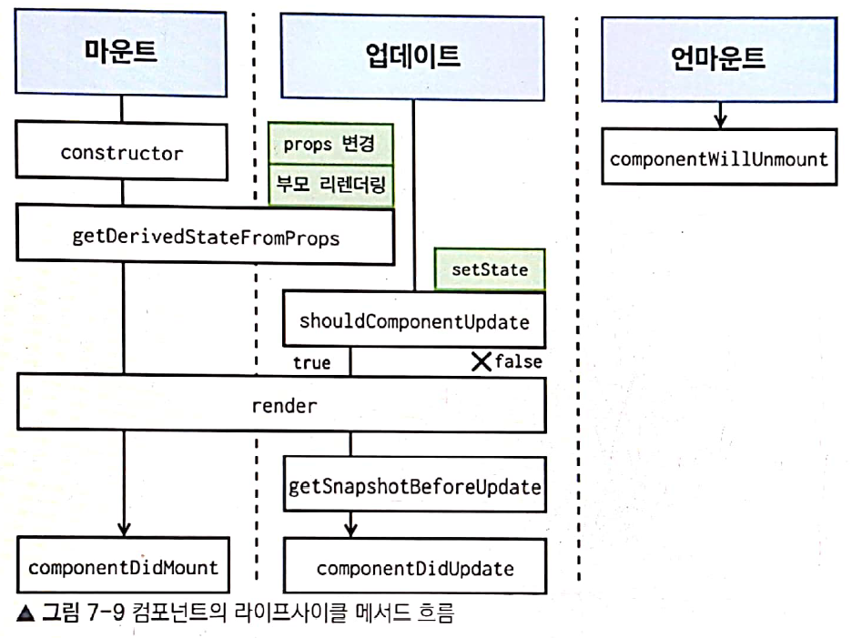

# 들어가기전에 
 * render() 함수란?
    - 컴포넌트 모양새를 정의. 메서드 안에서 this.props & this.state접근가능 리엑트요소(div, component). 만양 아무것도 보여주고 싶지 않을시 null or fals값을 리턴한다.
    *주의 사항 : 이 메서드안에서는 절대로 state변형해서는 안 되며, 웹브라우저에 접근해서도 안됩니다. (compoenetDidMount 사용)

# 라이프사이클 메서드 종류 : 10 (Will, Did)

# 마운트: 페이지에 컴포넌트가 나타남.

    - constructor : 컴포넌트 생성치 처음으로 실행
    - getDeriverdStateFromProps : props에 있는값을 state에 동기화
    - render 
    - componentDidMount: 컴포넌트가 웹브라우저상에 나타난 후 호출하는 메서드(setTimeout, setInterval, network request)

# 업데이트: 컴포넌트 정보를 업데이트 (리렌더링)
    * 컴포넌트를 업데이트할 때
     - props 변경시
     - state 변경시
     - 부모 컴포넌트가 리렌더링할때
     - this.forceUpdate 로 강제롤 렌터링을 트리거할 때
    * 메서드 종류
     - getDeriverdStateFromProps : props가 바뀔때 호출(마운트과정에도 호출)
     - shouldComponentUpdate: 컴포넌트가 리렌더링을 해야할지 말지 결정하는메서드 만약 false리턴시 아래 메서는 호출되지 안는다
     - getSnapshotBeforeUpdate: render 메서드 호출후, 변경사항을 Dom에 반영하기 바로 직전 호출
     - componentDidUpdate: 컴포넌트의 업데이트 작업이 끝난 후 호출(DOM 관련처리를해도 무방하다)

# 언마운트: 페이지에서 컴포넌트가 사라짐
    * 컴포넌트를 DOM에서 제거 할때
    - componentWillUnmount (등록이벤트, 타이머 제거)

# 라이트 사이클 흐름도

