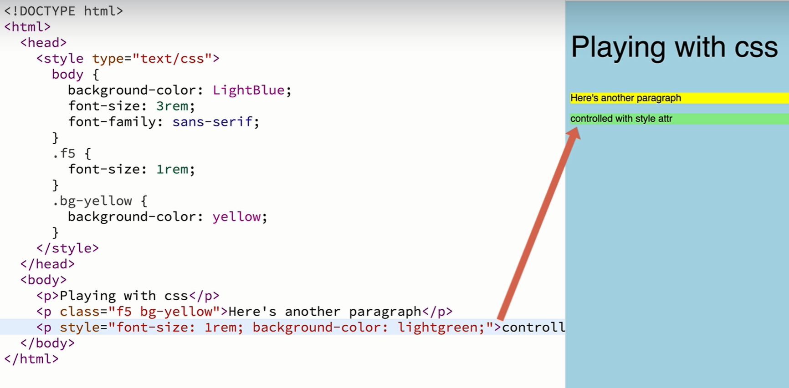

## DOM(Document Object Model): Structure you can interact with program like JavaScript


## Tree Structure(includes nodes) 


## CSS: Cascading Style Sheets
Font-size: rem, em

id>class>element
Class : multiple add

## CSS library 'Tachyons'
https://tachyons.io/#style

### Compose CSS Classes
```js
<link rel="stylesheet" href="https://unpkg.com/tachyons@4.10.0/css/tachyons.min.css"/>
```

```html
<head>
  <link rel="stylesheet" href="https://unpkg.com/tachyons@4.10.0/css/tachyons.min.css"/>
</head>
</body>
  <button>Save</button>
  <button class="pa3">Save</button>
</body>
```

```js
npm install --save-dev tachyons@4.10.0
git clone git@github.com:tachyons-css/tachyons.git
cd tachyons
npm install && npm start
```


