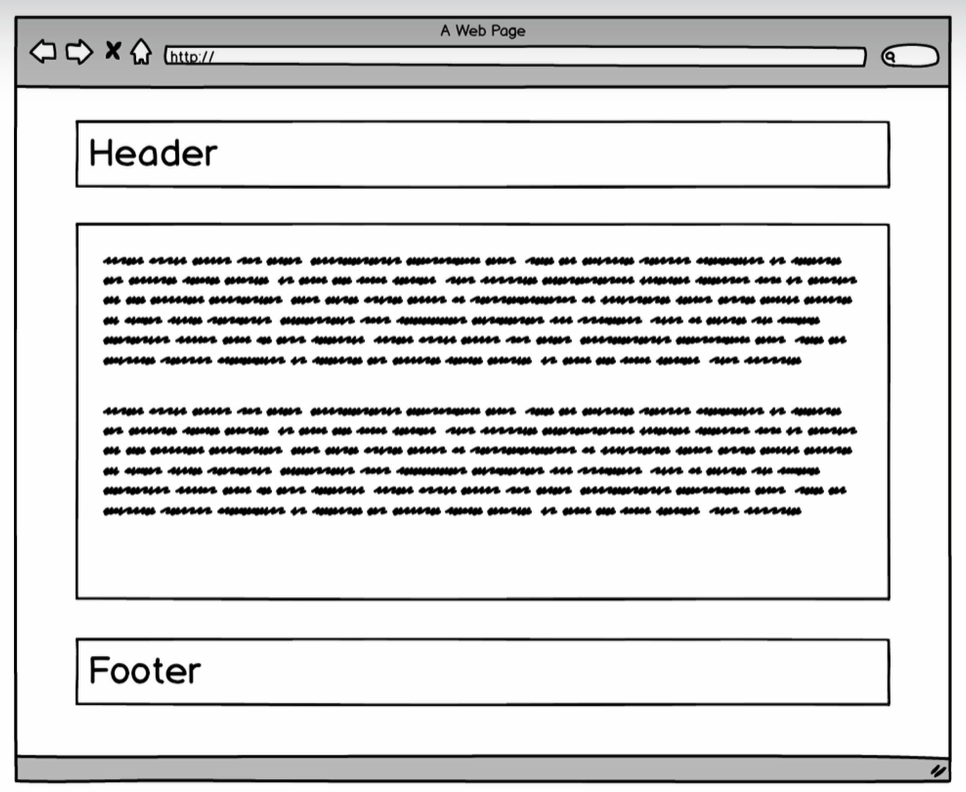
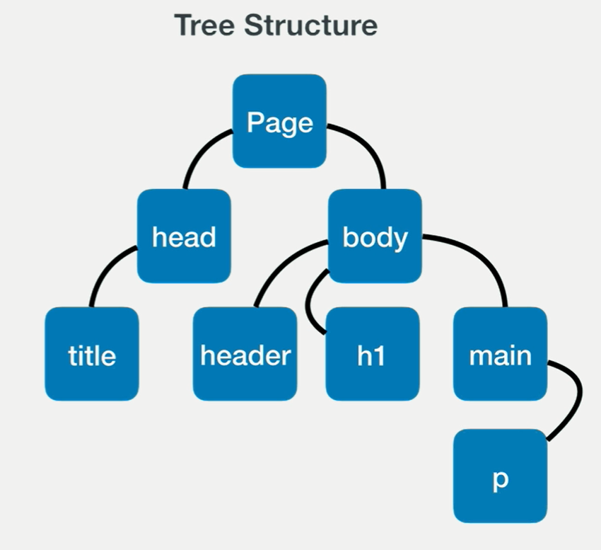
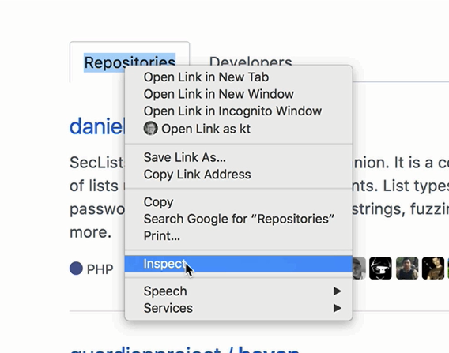

## DOM(Document Object Model): Structure you can interact with


# Tree Structure


# Node



# CSS: Cascading Style Sheets
Font-size: rem, em

id>class>element
Class : multiple add

# CSS library
```js
<link rel="stylesheet" href="https://unpkg.com/tachyons@4.10.0/css/tachyons.min.css"/>
```
```js
npm install --save-dev tachyons@4.10.0
git clone git@github.com:tachyons-css/tachyons.git
cd tachyons
npm install && npm start
```
# Compose CSS Classes
https://tachyons.io/#style
